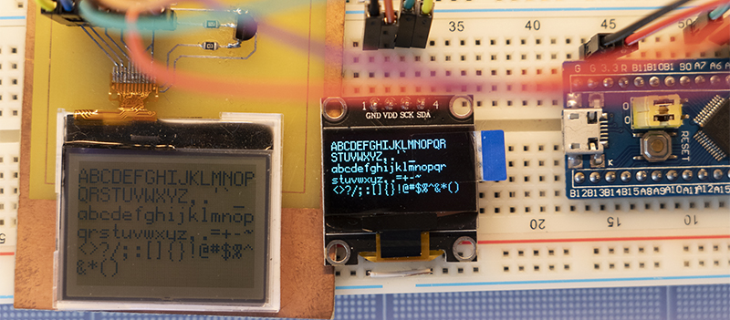

# U8G2FontRender

Platform and display agnostic library for render fonts from [u8g2](https://github.com/olikraus/u8g2/) project.

> Basically, for now, it's a one-day build project. That's why it very simple and probably doesn't have all features. Don't hesitate to create PRs with changes that you need or issues.

U8g2 is a great project that has many fonts out of the box. As well as a set of scripts to generate new fonts from fonts for your system.



## How to use

As library platform and display agnostic, you should create two functions with `void fn(uint8_t x, uint8_t y)` signature, one for render foreground pixel and another for render background pixel. It gives you the opportunity to control colors, inversion, and other different parameters on text rendering.

And get font(s) from [u8g2](https://github.com/olikraus/u8g2/) library (`csrc/u8g2_fonts.c` file).

```c
#include "u8g2_font_render.h"
...
  
U8G2FontRender_t font = U8G2FontRender(u8g2_font_arr, &fnDrawFgPixel, &fnDrawBgPixel);
U8G2FontRender_Print(&font, 0, 0, "Hello, World!");
```

## Tested using

Dev boards / MCUs:

* STM32F103C8 (BluePill)

Displays:

* SSD1306
* Nokia 1202
